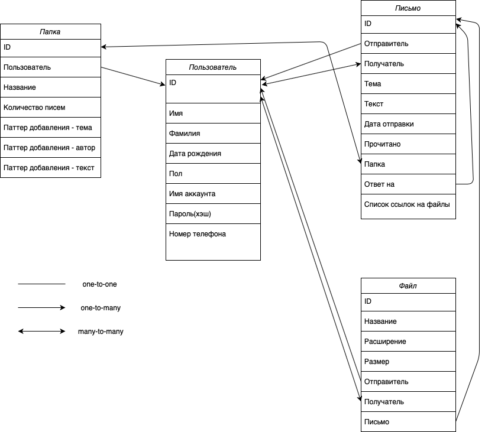

# TPark_Highload

Курсовой проект
=================

В данном проекте будет рассмотрен почтовый сервис, который позволяет клиентам 
читать и отправлять письма, также имеется возможность отправки с различными вложенными файлами.


Часть 1. Определение возможного диапазона нагрузок
=================

Согласно [wikipedia](https://ru.wikipedia.org/wiki/Население_России) население России к 2020 году можно принять равным 
146млн человек.
А согласно [yandex.radar](https://radar.yandex.ru/yandex?month=2020-08) среднее количество уникальных пользователей 
Яндекс почты составляет примерно 17млн человек в месяц , что составляет 11% от населения России.
Согласно [similarweb](https://www.similarweb.com/website/mail.yandex.ru/) у почты Яндекса общее количество посещений в 
месяц примерно 400млн(У почты Mail.ru - более 540млн), со средним временем нахождения пользователя на сайте - 8 минут.
Общее количество активных аккаунтов почты mail.ru составляет [100млн](https://corp.mail.ru/ru/company/portal/) <br>
Лимит на объем одного письма без вложения сделаем равным 10MB.
Есть возможность прикреплять файлы(вложения),максимальный объем вложений в сумме - 20MB (Чуть меньше, чем [(Почта Яндекса)](https://yandex.ru/support/mail/web/letter/attachments.html) )
<br>

Возможности пользователя, которые ему предоставляет почта:
* Регистрация
* Авторизация
* Постраничное получение списка последних писем
* Отправка и пересылка писем
* Удаление писем
* Чтение писем
* Скачивание вложений из писем
<br>

Определим **среднего пользователя** нашего сервиса.Пускай он пишет и читает по 5 писем в день(В 2 раза меньше, чем Яндекс),
а список писем получает 10 раз в день. Согласно [Яндекс1](https://habr.com/ru/company/yandex/blog/199432/) 
и [Яндекс2](https://habr.com/ru/post/321756/) примерно 10% писем включают в себя вложения.Средний размер 
письма без вложения - 4KB, а с вложением - 400KB.Средний ящик пользователя - 6000 писем, из которых примерно 
2000 были получены за последние 2 года(Будем считать эти данные горячими).
<br>
Учитывая дневную аудиторию Яндекс почты в [6.2 млн человек](https://radar.yandex.ru/yandex?month=2020-08), каждый из которых остается на сайте 
примерно 8(мы возьмем 5 для усреднения) минут, то ,можно провести эксперимент, предложив среднестатистическому 
пользователю провести на сайте почты это самое время.Используя вкладку network браузера , 
можно получить количество различных запросов, которые сгенерировал пользователь за это время равное - 500 штук.
```
RPS(общий) = (6.2*10^6 * 500)/(24*60*60) ~ 36000 (далее разобьем на разные сферы)
```

Часть 2. Выбор планируемой нагрузки
=================
Основываясь на цифрах из пункта 1, выберем целевые цифры для нашего проекта равными:
* 5 млн уникальных пользователей в день
* 80 млн активных аккаунтов (54% населения России, 80% от [Mail.ru](https://corp.mail.ru/ru/)
* Поддержка RPS = 30000(5000 - бэкенд, 20000 фронтенд/веб-сервер, 5000 - вспомогательные службы) запросов в секунду

Часть 3. Логическая схема базы данных
=================


Часть 4. Физическая системы хранения
=================

* Таблица пользователя в базе данных:

| id  | имя | фамилия | дата рождения | пол | имя аккаунта | пароль(хэш) | телефон |
|-----|-----|-----------|---------|-----------------|------------------|------------------|----|
|bigint|varchar(20)|varchar(40)|timestamp:date|boolean|varchar(80)|varchar(32)|varchar(11)|

Максимальный вес одного пользователя - 196 байт ~ 0,2KB

* Таблица сообщения в базе данных:

| id  | id отправителя | домен отправителя |id получателя |домен получателя | тема | текст | дата отправки | прочитано |id папки|id ответа|список ссылок на файлы|
|-----|-----|-----------|-----------|-----------|---------|-----------------|------------------|------------------|----|------|-------|
|bigint|bigint|varchar(80)|bigint array[5]|varchar(80) array[5]|varchar(50)|varchar(11000000)|timestamp|boolean|bigint|bigint|varchar(200)|

Максимальный вес одного письма - 11000811 байт ~ 10MB.
В id получателя храним список id пользователей,которым отправляется письмо.Как видно, можно 
указать максимум 5 пользователей.
<br>Отметим, что нашему пользователю могут приходить письма от пользователей других почт, и сам пользователь
может писать письма участникам других сервисов.Для этого будем хранить в таблицы домены отправителей и получателей.
Если в поле id отправителя/получателя мы видим null, то это значит, что отправитель/получатель 
использует другой сервис.Чуть подробнее про работу с этим напишем ниже.

* Таблица списка сообщений главной страницы в базе данных:

| id  | id отправителя | id получателя | тема | короткий текст | дата отправки | прочитано |
|-----|-----|-----------|---------|-----------------|------------------|------------------|
|bigint|bigint|bigint array[5]|varchar(50)|varchar(50)|timestamp|boolean|

Максимальный вес одного короткого письма - 161 байт ~ 0,15KB

* Таблица папок в базе данных:

| id  | id пользователя | название | количество писем | паттерн добавления - тема | паттерн добавления - автор | паттерн добавления - текст |
|-----|-----|-----------|---------|-----------------|------------------|------------------|
|bigint|bigint|varchar(20)|bigint|varchar(50)|varchar(80)|varchar(100)|

Максимальный вес одной папки - 274 байт ~ 0,3KB
<br>
В качестве СУБД будет использоваться [LevelDB](https://github.com/google/leveldb).
Для каждого пользователя на сервере с СУБД будет создана папка, в которой будут храниться все связанные с 
ним сущности(Иконки,письма,вложения,данные о папках).Это позволит получать сообщения пользователя, 
конкретно из его стораджа, а не из какой-то общей таблицы,в которой будет миллионы сообщений, 
что очень замедлит поиск.<br>

Согласно пунктам 7 и 9 из [benchmark](https://web.archive.org/web/20151020214950/http://symas.com:80/mdb/microbench/)
При размере данных в 100B и 128MB кеша:
* Random Reads - 137,231 ops/sec
* Random Writes - 176,929 ops/sec
* Batch Random Writes - 229,095  entries/sec

Основной проблемой в данной ситуации будет огромный объем базы данных, что вынудит нас 
использовать шардирование по uid. То есть на одном физическом сервере с базой данных будут храниться 
те строки в таблицах,которые относятся к диапазону юзеров,размещенных на этой машине.
В LevelDB нет удобной возможности шардинга в комплекте,поэтому стоит использовать хранилища типа ключ-значение, 
где ключ - uid пользователя, а значение - указание на конкретный сервер с данными.Возможно, что для экономии стоит 
объединить эту задачу с хранением кук и получить ключ - user_cookie , а значение - id и его сервер.
Для подобных задач отлично подходит Redis. Если Redis не находит у себя данных о домене получателя(например),
то будем считать, что получатель принадлежит другому сервису.И бэкенд будет производить соответствующие действия для
отправки письма на стороннюю почту(может даже произойти так, что не будет найден сторонний сервис,которому принадлежит 
указанный домен.Тогда об этом будет сообщено пользователю).

Рассмотрим разные нагрузки от различных типов запроса:<br>
**1)** Получения списка последних писем (50 штук).Не забудет про web-socket запросы , которые автоматически будут
спрашивать сервер о новых письмах.Данные будут браться из отдельной таблицы коротких сообщений. 
Согласно исследованию, данный запрос будет весить примерно 23KB данных,без учета иконок почт 
отправителей( [1](images/message_list_proof.png) и [2](images/message_list_size.png )).Учитывая цифры для 
среднего пользователя из пункта 2, получаем:
```
RPS: 5 000 000 * (10+5) / 24 * 60 * 60 ~ 900
Передаваемый трафик: 5 000 000 * 10 * 23KB / 24 * 60 * 60 ~ 13800KB ~ 14MB
```
Получается, что для обработки получения списка писем хватит мощности одного сервера.<br>
**2)** Чтение одного письма - согласно исследованию, средний вес одного письма(в конечной для клиента форме)
 - 12KB без учета прикрепляемого файла.([3](images/single_message_proof.png) и [4](images/single_message_size.png) )
Примем, что пользователь читает хотя бы 5 писем в день.
Тогда получим:
```
RPS: 5 000 000 * 5 / 24 * 60 * 60 ~ 290
Передаваемый трафик: 5 000 000 * 5 * 12KB / 24 * 60 * 60 ~ 3480KB ~ 3,3MB
```
Для данной задачи мощности все того же одного сервера с LevelDB вполне достаточно.<br>
**3)** Написание письма - согласно пункту 2 мы считаем, что средний вес письма без вложения- 4KB,
а с вложением - 400KB. 

```
5 000 000 пользователей * 5 писем в день = 25 000 000 писем в день всего
25 000 000 * 0,9 = 22 500 000 писем без вложений
22 500 000 * 4Кб = 90 000 000Кб весят все письма за день =~ 85Гб
RPS писем без вложения: 5 000 000 * 5 / 24 * 60 * 60 = 289 

25 000 000 * 0,1 = 2 500 000 писем с вложениями
2 500 000 * 400Кб =~ 953Гб весят письма с вложениями
Вес вложений составляет 99% веса письма, тогда примем , что мы получаем 940Гб вложений в день.
RPS писем c вложениями: 5 000 000 * 1 / 24 * 60 * 60 = 58 
```
Данные загружаются на сервер со скоростью записи жесткого диска, наша база записывает в себя
по сути только снипетт на сохраняемый файл.
<br>

Отдельно обсудим систему архивного хранения писем.База наших писем ожидается действительно огромной,
поэтому эффективным решением будет разделение "горячих" и "холодных" данных.Согласно пункту 2 
мы считаем данные "горячими" ,если с момента их добавление прошло не более 2 лет(шардирование по дате).
В более быстрых хранилищах мы будем хранить эти свежие данные, а в более вместительных - более старые 
данные, потому с бизнес-точки зрения мы согласны с тем,что если пользователь требует старые 
данные,то он готов подождать чуть дольше.

<br>
Перенос писем из "горячих" серверов в "холодные" будет осуществляться отдельной группой серверов в течение года.
По окончанию копирования данных сервер переноса просит сервер "горячих" данных
удалить перенесенные сообщения.


Часть 5. Выбор технологического стека проекта(кроме СУБД)
=================

**Бэкенд:** Главным языком для серверной разработки будет выбран Golang, который позволяет быстро и эффективно 
писать код.В его основе лежит теоретическая модель [CSP](https://en.wikipedia.org/wiki/Communicating_sequential_processes).

```
Scalling by adding more of the same

Golang UK Conference 2017 by Arne Claus
```

Она обеспечит хорошую масштабируемость Бэкенда, а также позволит избежать блокировок при конкурентном доступе. 
В основном код будет написан с использованием обширной стандартной библиотеки, роутером будет выбран 
[fasthttp](https://github.com/valyala/fasthttp), который показывает наилучшие показатели производительности.
Безусловно , нужно учитывать трудности со сборщиком мусора, который будет снижать производительность 
раз за какое-то  △t времени.Поэтому необходимо будет учитывать не только среднюю производительность , 
но и ее нижнюю границу.

**Фронтенд:** Выбор CSS,HTML,TypeScript/JavaScript , как технологий для фронтенд составляющей проекта будет
обусловлен их популярностью и изученностью годами.Для JavaScript существует уже огромное количество библиотек ,которые
как и упрощают верстку, так и способны влиять на производительность кода.TypeScript способен и ускорить
разработку из-за отлавливания ошибок при компиляции, и обезопасить наш будущий код от непредсказуемого поведения.

**Протоколы:** В данном проекте подразумевается использование https и http2 для связи клиента с бэкендом.Также будет
реализована связь с помощью websocket протокола, для отображения новых пришедших пользователю сообщений(как пример)
в режиме реального времени.
Связь микросервисов на бэкенде будет осуществляться классическим для Golang'а способом -  через GRPS+Protobuf, что
является одним из самых эффективных способов общения как с точки зрения скорости, так и с точки зрения размера 
передаваемого трафика.


Еще раз распишем путь нашего запроса по шагам.Для примера возьмем написания письма с вложением.
Пускай пользователь уже зарегистрирован.Рассматривать будем только позитивные сценарии.<br>
**1)** Пользователь запрашивает наш сайт. Веб-сервер(о нем речь пойдет ниже) отдает ему необходимую 
статику,а потом перенаправляет запросы с заголовками на бэкенд.<br>
**2)** Бэкенд просит Redis отдать ему id пользователя и сервер с его данными по cookie.Далее бэкенд сервер
осуществляет соединение с БД по полученному адресу и запрашивает оттуда базовую информацию о пользователе.После 
получения отдает все обратно клиенту.<br>
**3)** У клиента отобразилась стартовая страница со всеми данными.Он переходит в раздел написания письма.Создает 
его,прикрепляет файл и совершает отправку.<br>
**4)** Отправка с вложениями по REST API методу отличается от отправки без вложения.Веб-сервер  
отправляет запрос на бэкенд.<br>
**5)** Бэкенд сообщений узнает у Redis'a в какой сервер БД направляется это сообщение и отправляет по этому 
адресу.
**7)** Сервер БД получает письма, сохраняет их в папку пользователя, записывает необходимую информацию об этом 
в levelDB.<br>


Часть 6. Расчет нагрузки и потребного оборудования
=================
БД:<br>
В 4 пункте были рассмотрены многие цифры, касательно системы писем и пользователей.
Предположим, что у одного юзера в среднем 6000(2000 "горячих") писем в ящике всего(отправленные и входящие во всех папках) и все папки.
Получаем
```
Общий объем для хранения писем без вложений = 80млн * 5600 * 4KB ~ 1668 TB
Общий объем для хранения писем с вложениями= 80млн * 600 * 400KB ~ 17881 TB

Общий "горячий" объем для хранения писем без вложений= 80млн * 1800 * 4KB ~ 537 TB
Общий "холодный" объем для хранения писем без вложений= 1668TB - 537TB ~  1131 TB

Общий "горячий" объем для хранения писем с вложениями= 80млн * 200 * 400KB ~ 5960 TB
Общий "холодный" объем для хранения писем с вложениями= 17881TB - 5960TB ~  11921 TB

```

```
Средний вес одного "горячего" пользователя со всеми данными  = 
0,2KB(данные о пользователе) + (1800 * 4KB)(письма без вложений) + (200 * 400KB)(с вложениями) 
+ (6 * 0,3KB)(папки) = 88000 KB ~ 79 MB


Средний вес одного "холодного" пользователя без посторонних данных  = 
(3600 * 4KB)(письма без вложений) + (400 * 400KB)(с вложениями) = 174 400 KB ~ 170MB
```
Для хранения данных об одном "горячем" пользователе нужно 79MB.

Выходит, что если мы закупим сервера вида:

| CPU(cores) | RAM(GB) | SSD(GB)/2-unit(10) |
|------------|---------|---------|
| 8         | 32      | 4096 x 10    |


то на один из них с учетом запаса под рост данных в 50% на нем уместится 20480GB/79MB ~ **265 000  пользователей**.
Всего таких серверов понадобится 80 000 000 / 265 000 = **300 штук**
Надежность этих данных требуется высокая, поэтому нам придется делать по 2 реплики к каждому.
**Итого 600 реплик, 900 серверов всего.**

Что касается архивных данных , то тут мы воспользуемся конфигурацией(Опробуем новинки 2020 года
в лице 18 - терабайтных жестких дисков)

| CPU(cores) | RAM(GB) | HDD(TB)/2-unit(8) |
|------------|---------|---------|
| 8         | 32      | 18 * 8   |

На такой сервер с учетом запаса данных в 66% на нем уместится 72TB/170MB ~ **444 000  пользователей**.
Всего таких серверов понадобится 80 000 000 / 444 000 = **180 штук**
На холодные сервера не сильная нагрузка и не такие высокие требования к надежности, поэтому нам хватит 
по 1 реплики к каждому. **Итого еще 180 реплик , 360 серверов всего.**

Сервер Redis:<br>
Из 30000 запросов примерно в половине требуется информация о пользователе.
Примем RPS = 15 000. Согласно [redis_bench](https://gist.github.com/sfc/216135) мы видим, что 8 ядер
нам более чем достаточно.Возьмем

| CPU(cores) | RAM(GB) | SSD(GB) |
|------------|---------|---------|
| 8         | 32      | 512    |

Однако надежность этого сервиса крайне важна, поэтому сделаем ему целых 3 
реплики.Итого **4 сервера**. У Redis'а есть удобная встроенная репликация, что является плюсом.

Фронтенд:<br>

Объем фронтенд составляющей примерно 3MB.Тогда подсчитаем, что <br>
3 * 5 000 000(количество пользователей в день) = 15 000 000 MB/день = 173MB/s

Много физической памяти фронтенд серверу не особо надо,она будет потрачена в основном на кеширование запросов, 
а вот RAM ему понадобиться побольше.Возьмем:

| CPU(cores) | RAM(GB) | SSD(GB) |
|------------|---------|---------|
|   8       | 32      | 512    |

В количестве **3 штук**.

Балансировщик:<br>

В пункте 2 мы выбрали общую нагрузку в 30000RPS. Будем использовать nginx.Согласно [nginx_test](https://www.nginx.com/blog/testing-the-performance-of-nginx-and-nginx-plus-web-servers/)
при среднем объеме требуемого пользователю контента в 10MB , мы видим , что можем обойтись 16 ядрами и 32GB RAM.

| CPU(cores) | RAM(GB) | SSD(GB) |
|------------|---------|---------|
|   16       | 32      | 512    |

Но оставлять всего лишь один веб-сервер - опасно.Возьмем еще 2(**Итого 3**) запасных дополнительно,которые будут 
подменять первый при падении.Между ними настроим [CARP](https://en.wikipedia.org/wiki/Common_Address_Redundancy_Protocol).
При падении главного веб-сервера его IP подхватит другой и полностью заменит его.

Бэкенд:<br>

Бэкенд должен соответствовать производительности БД, но благодаря микросервисной архитектуре мы 
грамотно разбиваем нагрузку. Согласно [5](images/img_requests.png) и [6](images/xhr_requests.png), мы видим
что большая часть запросов - получение картинок(50/50 статика - пользовательские) и вспомогательные запросы для 
клиентской стороны.Из суммарных 30000RPS на бэкенд приходится лишь примерно 5000, которые и распределяются по 
микросервисам. Если мы возьмем 5 микросервисов, 2 для авторизации и 3 для работы с сообщениями,то каждому из них 
будет достаточно следующих параметров:

| CPU(cores) | RAM(GB) | SSD(GB) |
|------------|---------|---------|
|   8       | 16      | 512    |

Каждому из 5 микросервисов нужен по 1 запасному.Итого **10 серверов.**

Часть 7. Выбор хостинга/облачного провайдера и расположения серверов
=================
Для наших объемов данных экономически не выгодно использовать облачные сервисы,
поэтому мы реализовали все хранение сами.Наш сервис ориентирован на Россию,но все же не стоит
забыть и о СНГ.Эффективнее всего расположить основные сервера в западной части России, а расположение архивных 
можно и в средней/восточной ее части. Для уменьшения задержек можно добавить еще один фронтенд сервер в 
средней/восточной части России с его двумя запасами.Тогда количество фронтенд-серверов **примем равным 6.**

Часть 8. Схема балансировки нагрузки
=================

Выше уже говорилось, что будем использовать nginx для балансировки нагрузки на 7 уровне модели OSI(L7). 
Используем алгоритм Round Robin,который позволит равномерно распределить нагрузку.Так же отметим, что сам по себе 
nginx имеет инструменты для SSL. 

Часть 9. Обеспечение отказоустойчивости
=================

Для обеспечения устойчивости нашим многочисленным серверам БД необходимо поддерживать у них 
реплики.Сделать это только встроенным средствами LevelDB не выйдет.Будем использовать подход [activemq](https://activemq.apache.org/replicated-leveldb-store).
Будем использовать Apache ZooKeeper для выбора ведущего устройства из 
набора узлов , настроенных для репликации хранилища LevelDB. Затем синхронизировать все 
подчиненные хранилища LevelDB с ведущим устройством(оригиналом), обновляя их, подтягивая все обновления 
с ведущего устройства.Все операции обмена сообщениями, требующие синхронизации с диском, перед завершением 
будут ждать репликации обновления в кворум узлов.Для нашей конфигурации из 3 серверов, кворум равен 2 голосам.
Ведущее устройство сохранит обновление локально и будет ждать, пока 1 другое ведомое устройство 
сохранит обновление, прежде чем сообщать об успехе.
Реплицированное хранилище LevelDB использует те же файлы данных, что 
и оригинальное хранилище LevelDB, поэтому мы можем переключать конфигурацию между реплицированным 
и нереплицированным в любое время.Роль Apache ZooKeeper в этой схеме будет по сути администрирующая.
Он будет отвечать за подсчеты кворумов,назначения какого-то сервера главным,смену главного сервера при падении 
текущего(будем выбираться реплика с самой свежей датой последних данных).
